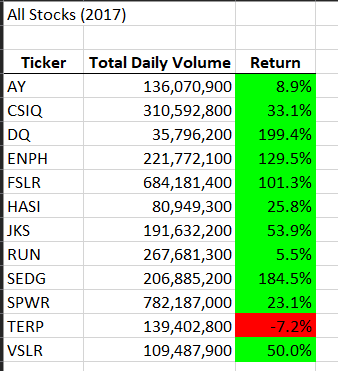
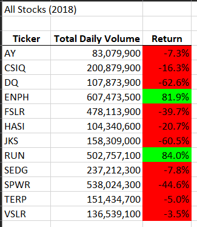

# Challenge 2 - Stock Analysis

## Purpose
The purpose of this exercise was analyze a set of stock ticker information for a handful of stocks in the green energy segment and provide some basic analytics for the years 2017 and 2018.

## Results
A Visual Basic script was used to read through all rows of data and aggregate information for each of the 12 stock tickers. On a separate sheet, the information was output and formatted.  The script was run for each year, and a screenshot was taken. Both years' aggregate results (2017 and 2018) can be seen below.

Additionally, the initial code was refactored once to improve the processing speed.  This was done primarily by using an 